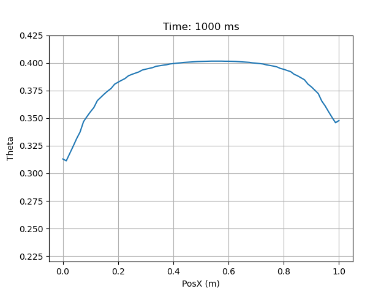

Slight differences near bounding vertices probably due to:
    1. Using DG, or
    2. Reversed read/write of temperatures/heat fluxes compared to example, but unlikely

Also interesting: top part matches the precice tutorial cases better

